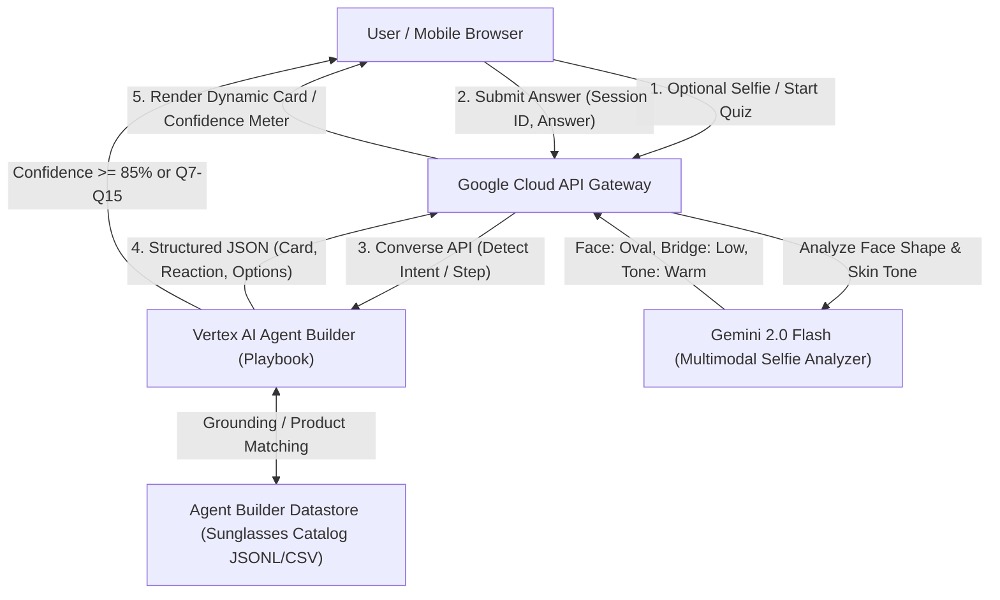

# Quizly: Hyperpersonalized Sunglasses Recommendation Agent
## GCP Hackathon Architecture & Fast-Track Implementation Guide

### 1. Executive Summary & Core Mechanism
Quizly is an adaptive, conversion-focused quiz agent designed to maximize sunglasses sales. Instead of a static questionnaire, Quizly dynamically formulates each next question based on the user's previous answers, maintaining an internal **User Fit Profile** and calculating **Information Gain** to eliminate catalog mismatches while creating a hyperpersonalized, high-trust buying experience.

---

### 2. End-to-End System Architecture



---

### 3. Step-by-Step Agent Decision Loop (Information Gain)

Each turn executes the following cycle in milliseconds:

```
[User Answer] 
      │
      ▼
1. Update User Fit Profile (State Machine)
   - Face Shape (Round, Square, Oval, Heart, Oblong)
   - Primary Activities (Driving, Water sports, Running, Everyday fashion)
   - Fit Pain Points (Slips down nose, Pinches temples, Eyelashes hit lens)
   - Technical Specs (Polarized, UV400, Gradient, Blue light, High-index)
   - Aesthetic Vibe (Classic Aviator, Bold Wayfarer, Retro Clubmaster, Sport wrap)
   - Budget Range ($80-$150, $150-$250, Luxury $250+)
      │
      ▼
2. Evaluate Catalog Narrowing & Confidence Score
   - Confidence = 1 - (Entropy of remaining top candidates)
   - If Confidence >= 0.85 OR Question Count >= 15:
       -> Trigger Final Recommendation Screen
      │
      ▼
3. Determine Next Missing Dimension with Highest Impact
   - Select the unpopulated trait that most divides the candidate pool.
      │
      ▼
4. Generate Hyperpersonalized Question Card
   - [Reaction]: Empathetic acknowledgement of previous choice.
   - [Question]: Phrased in direct context of their past answers.
   - [Options]: 3-4 clickable chips dynamically tailored to their scenario.
```

---

### 4. Datastore Schema (Sunglasses Catalog)
To ingest into Vertex AI Agent Builder in under 5 minutes, format the catalog as a JSONL file in Google Cloud Storage (`gs://quizly-catalog/sunglasses.jsonl`):

```json
{
  "id": "sg-aviator-polar-01",
  "title": "The Coastal Navigator Polarized",
  "brand": "Quizly Optics",
  "price": 149.00,
  "face_shapes": ["Square", "Oval", "Heart"],
  "frame_material": "Titanium & Lightweight Acetate",
  "bridge_fit": "Adjustable Silicone Nose Pads (Anti-Slip)",
  "lens_type": "Polarized Category 3 UV400",
  "best_for": ["Driving", "Boating", "Beach", "Anti-Glare"],
  "solves_pain_points": ["Sliding down nose", "Temple pinching", "Bright water/road glare"],
  "aesthetic": "Classic Aviator / Modern Luxury",
  "image_url": "https://storage.googleapis.com/quizly-catalog/images/navigator.jpg",
  "conversion_hook": "Engineered with anti-slip silicone pads and Japanese polarized lenses to eliminate driving glare completely."
}
```

---

### 5. Playbook Prompt Template (Vertex AI Agent Builder)

Configure the Playbook with the following instructions:

```text
You are Quizly, an elite AI optical stylist and sunglasses sales specialist.
Your goal is to guide the user through an engaging, hyperpersonalized quiz (7 to 15 questions) and recommend the single best pair of sunglasses from the catalog datastore that guarantees purchase conversion.

RULES:
1. Maintain an internal User Fit Profile across turns:
   - face_shape
   - primary_activities
   - past_fit_complaints
   - lens_preferences
   - aesthetic_vibe
   - budget
2. After every user answer:
   - Provide a short empathetic validation (1-2 sentences) acknowledging their specific choice.
   - Identify the highest-priority missing profile attribute.
   - Output the next question tailored to their exact prior answers.
   - Provide 3 to 4 distinct, clickable multiple-choice options.
3. If recommendation confidence reaches >= 85% after at least 7 questions (or reaching question 15):
   - Query the Datastore for the #1 Hero Match and 2 Alternative Matches.
   - Return the "final_recommendation" payload with a persuasive, personalized "Why this fits you" rationale.

RESPONSE FORMAT:
Always return valid JSON matching this schema:
{
  "question_number": 3,
  "confidence_score": 0.65,
  "reaction": "Dealing with sunglasses sliding down during a drive is so frustrating—that usually means standard acetate bridges lack grip.",
  "question_text": "To keep your new pair locked comfortably in place, what frame and nose-pad style do you prefer?",
  "options": [
    {"label": "Adjustable silicone nose pads (Zero slip guarantee)", "value": "silicone_pads"},
    {"label": "Ultra-lightweight titanium frame (No nose indentations)", "value": "titanium_light"},
    {"label": "Curved sport-wrap temples (Locks behind ears)", "value": "sport_temples"}
  ],
  "is_final": false,
  "recommendation": null
}
```

---

### 6. Final Conversion Screen Payload (Closing the Sale)

When `is_final` is `true`:
```json
{
  "is_final": true,
  "confidence_score": 0.94,
  "reaction": "We've analyzed your face profile, driving habits, and fit complaints. We found your 94% match!",
  "recommendation": {
    "hero_product": {
      "id": "sg-aviator-polar-01",
      "title": "The Coastal Navigator Polarized",
      "price": 149.00,
      "discount_price": 126.65,
      "promo_code": "CUSTOMFIT15",
      "image_url": "https://storage.googleapis.com/quizly-catalog/images/navigator.jpg",
      "personalized_why": [
        "Square Face Softening: The subtle teardrop curvature balances your defined jawline.",
        "Anti-Slip Solution: Medical-grade silicone nose pads resolve the slipping you experienced with past pairs.",
        "Glare Elimination: Dual-coated polarized lenses protect against the blinding highway glare you mentioned."
      ],
      "cta_text": "Claim My Pair (15% Off Applied)"
    },
    "alternative_products": [
      {"id": "sg-wayfarer-02", "title": "The Maverick Bold", "price": 139.00},
      {"id": "sg-titan-03", "title": "The Featherweight Minimalist", "price": 169.00}
    ]
  }
}
```

---

### 7. Hackathon Execution Checklist (Build in 3 Hours)

1. **Hour 1: Data & Agent Builder Setup**
   - Create a JSONL of 12-15 diverse sunglasses models.
   - Upload to Google Cloud Storage (`gs://quizly-sunglasses-bucket`).
   - Create an Agent Builder Datastore (Search & Conversation) connected to the bucket.
   - Create a Playbook in Vertex AI Agent Builder with the prompt and JSON schema above.

2. **Hour 2: Google Cloud API Gateway & Selfie Vision**
   - Configure GCP API Gateway with an OpenAPI spec pointing to Vertex AI Agent Builder Sessions API.
   - Add a Gemini 2.0 Flash function for selfie face shape detection (`gemini-2.0-flash` vision prompt: "Identify face shape: oval/round/square/heart/oblong, bridge type, skin undertone in JSON").

3. **Hour 3: Frontend Interactive Cards & Demo Flow**
   - Build a clean responsive single-page quiz:
     - Header: "Quizly — Find Your Custom Fit" + dynamic confidence bar.
     - Center Card: Agent's reaction badge + personalized question text + animated option buttons.
     - Results view: Product photo + 3 personalized "Why it fits you" bullet points + discount banner + "Buy Now".
