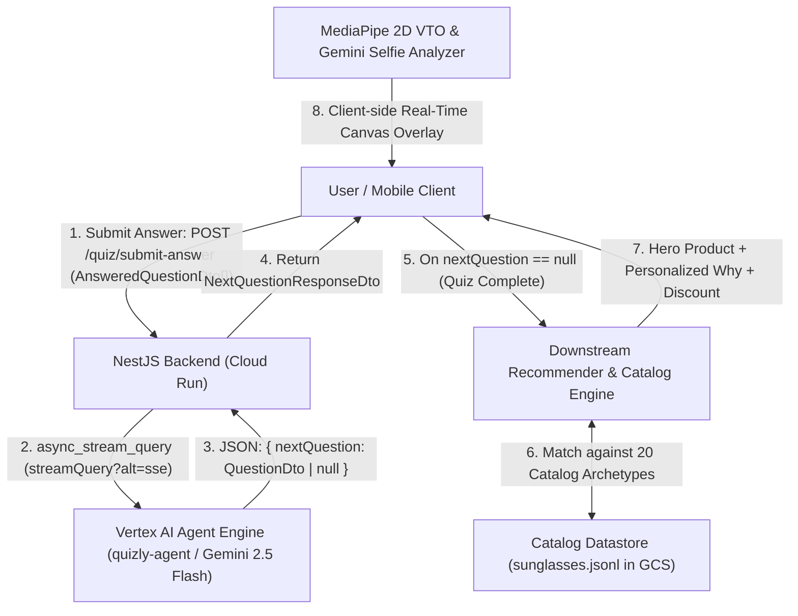

# Quizly: Hyperpersonalized Sunglasses Recommendation Agent
## GCP Hackathon Architecture & Fast-Track Implementation Guide

### 1. Executive Summary & Core Mechanism
Quizly is an adaptive, conversion-focused eyewear consultation platform designed to maximize sunglasses sales. Instead of a static questionnaire, Quizly uses a turn-by-turn AI consultation agent running on Vertex AI Agent Runtime (Reasoning Engine) to dynamically formulate each subsequent question based on the customer's prior responses. 

The architecture strictly decouples **diagnostic consultation** from **product matching & offer generation**:
- **The Quizly Agent**: Acts as an elite optical stylist. It asks questions with high diagnostic precision across 4 pillars (Cephalometrics, Ergonomics, Lens Optics, Style Semiotics) to maximize buyer confidence and extract high-fidelity fit parameters (7 to 15 questions total).
- **The Downstream Recommendation & VTO Engine**: Takes the completed diagnostic profile, matches the #1 hero sunglasses and runner-up pairs from the catalog (`sunglasses.jsonl`), generates personalized "Why It Fits You" conversion rationales, and renders the 2D MediaPipe Visual Try-On (VTO) overlay.

---

### 2. End-to-End System Architecture



---

### 3. Step-by-Step Diagnostic Decision Loop (7–15 Question Funnel)

Each turn executes the following cycle:

```
[User Answers Array: AnsweredQuestionDto[]] 
                      │
                      ▼
 1. Evaluate Question Count (N) & Stopping Criteria
    - If N < 7: STRICTLY CONTINUE (Cannot return null)
    - If N >= 15: STRICTLY TERMINATE (Return nextQuestion: null)
    - If 7 <= N < 15: Check Pillar Completeness
                      │
                      ▼
 2. Information Gain Across 4 Ontological Pillars
    - Pillar 1: Face Shape & Cephalometrics (Ratio, Jawline, Width, Bridge)
    - Pillar 2: Past Pain Points & Ergonomics (Slipping, Pinching, Cheek clearance)
    - Pillar 3: Lifestyle & Optical Environments (Glare, Driving, Water, High UV)
    - Pillar 4: Style Archetype & Semiotics (Lineage, Presence, Lens privacy)
                      │
                      ▼
 3. Select Next Question (Fulfills QuestionDto contract)
    - "binary": Exactly 2 answers
    - "singleChoice": 2 to 4 answers
    - "multiChoice": Exactly 4 answers
                      │
                      ▼
 4. Return Output Payload to Backend
    - { "nextQuestion": QuestionDto }
    - (Or { "nextQuestion": null } if survey complete)
```

---

### 4. Official API Data Transfer Objects (DTOs)

The backend exposes `POST /quiz/submit-answer` implemented in [`apps/backend/src/app.controller.ts`](file:///Users/illia.kazachkovskyi/Documents/Illia%20Project/quizly/apps/backend/src/app.controller.ts) using the TypeScript contracts defined in [`apps/backend/src/quiz.dto.ts`](file:///Users/illia.kazachkovskyi/Documents/Illia%20Project/quizly/apps/backend/src/quiz.dto.ts):

#### Supported Question Types
```typescript
export const QUESTION_TYPES = [
  'binary',
  'multiChoice',
  'singleChoice',
] as const;
export type QuestionType = (typeof QUESTION_TYPES)[number];
```

#### Request Payload: `AnsweredQuestionDto[]`
The frontend sends an array containing every question asked so far along with the user's selected answers (send `[]` to initiate turn 1):

```typescript
export class AnsweredQuestionDto {
  question: string;
  answers: string[];
  typeOfQuestion: 'binary' | 'singleChoice' | 'multiChoice';
  selectedAnswers: string[];
}
```

*Example HTTP Request Body:*
```json
[
  {
    "question": "Is your face noticeably longer than it is wide, or about equal?",
    "answers": [
      "Noticeably longer than wide",
      "About equal in length and width"
    ],
    "typeOfQuestion": "binary",
    "selectedAnswers": [
      "Noticeably longer than wide"
    ]
  },
  {
    "question": "What frustrates you most about sunglasses staying in place?",
    "answers": [
      "They slide down my nose constantly",
      "They leave red pinch marks on my nose",
      "They sit too high above my eyebrows",
      "No issues, they fit fine"
    ],
    "typeOfQuestion": "singleChoice",
    "selectedAnswers": [
      "They slide down my nose constantly"
    ]
  }
]
```

#### Response Payload: `NextQuestionResponseDto`
```typescript
export class NextQuestionResponseDto {
  nextQuestion: QuestionDto | null;
}

export class QuestionDto {
  question: string;
  answers: string[];
  typeOfQuestion: 'binary' | 'singleChoice' | 'multiChoice';
}
```

*Example A (Next Question):*
```json
{
  "nextQuestion": {
    "question": "Where will you wear these most? Pick all that apply.",
    "answers": [
      "City & everyday commuting",
      "Driving & road trips",
      "Water, beach, boating & snow glare",
      "Running, cycling & training"
    ],
    "typeOfQuestion": "multiChoice"
  }
}
```

*Example B (Survey Complete after 7–15 Questions):*
```json
{
  "nextQuestion": null
}
```

---

### 5. Datastore Schema (Sunglasses Catalog)

The product catalog contains 20 curated sunglasses archetypes stored as JSONL in Google Cloud Storage (`gs://quizly-catalog/sunglasses.jsonl`). Each product has complete cephalometric specs, pain point mappings, and conversion hooks:

```json
{
  "id": "sg-01-navigator-polar",
  "title": "The Coastal Navigator Polarized",
  "brand": "Quizly Optics",
  "price": 149.00,
  "currency": "USD",
  "face_shapes": ["Square", "Oval", "Heart"],
  "frame_width_mm": 142,
  "frame_size": "Standard",
  "weight_grams": 16.5,
  "frame_material": "Japanese Beta-Titanium with Acetate Rims",
  "bridge_architecture": "Adjustable Medical-Grade Silicone Nose Pads",
  "lens_type": "Polarized Category 3 Triacetate Cellulose (TAC)",
  "lens_tint": "Deep G-15 Olive Green with Dual Anti-Reflective Coating",
  "aesthetic_archetype": "Nostalgia / Aviation Heritage",
  "best_for_activities": ["Highway Driving", "Coastal Boating", "Beach Relaxation"],
  "solves_pain_points": [
    "Sliding down nose during perspiration",
    "Blinding sun glare bouncing off pavement or water",
    "Temple pinching behind the ears"
  ],
  "conversion_hook": "Engineered with featherlight titanium and micro-ribbed silicone pads that lock in place without pinching, paired with dual-layer polarized lenses that erase driving glare instantly.",
  "pitch_bullet_points": [
    "Teardrop Aviator Geometry: Curvilinear lower rim balances and softens defined square jawlines.",
    "Zero-Slip Silicone Grip: High-friction medical-grade pads prevent slippage even during humid summer heat.",
    "Glare-Cutting Polarized Optics: Category 3 lenses deliver razor-sharp contrast and stop squinting headaches."
  ]
}
```

---

### 6. Downstream Recommendation & Conversion Handoff

When `nextQuestion` is `null`, the client or backend triggers the conversion matching engine:
1. **Scoring & Ranking**: Scores the 20 catalog products against the user's answers across face proportions, solved pain points, lens requirements, and aesthetic preference.
2. **Hero Offer Presentation**:
   - Displays the #1 Hero product match + 2 alternative pairs.
   - 3 personalized "Why It Fits You" bullet points resolving their specific pain points.
   - Interactive 2D Visual Try-On (VTO) using MediaPipe landmarks.
   - Exclusive checkout incentive (e.g. `CUSTOMFIT15` for 15% off).
