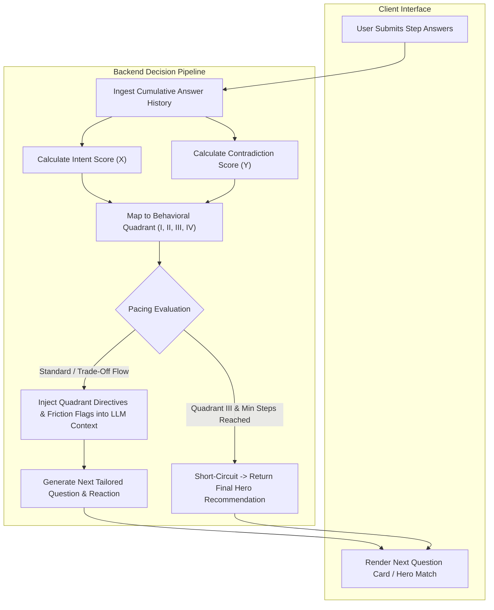

# Quizly Dynamic Onboarding: 2-Axis Psychometric Engine
## Methodology for Real-Time Churn Detection, Intent Modeling & Dynamic Question Steering

---

## 1. Executive Summary & Core Methodology

In Quizly’s dynamic onboarding, questions are not drawn from a static decision tree. Instead, the backend dynamically calculates each successive question, adapting in real time to the user's implicit mental state.

While traditional onboarding relies on superficial heuristics (e.g. staring at a question for 20 seconds or always picking the last option), Quizly operates on a continuous **2-Axis Psychometric State Space**:

1. **Intent Axis ($X \in [-1.0, +1.0]$):** Measures cognitive capital, urgency, and purchase determination versus apathy, passivity, and acquiescence.
2. **Contradiction Axis ($Y \in [0.0, +1.0]$):** Measures logical, material, semiotic, and behavioral friction across submitted answers.

```
                          HIGH CONTRADICTION (+1.0)
                                      ▲
                                      │
              QUADRANT II             │             QUADRANT I
         The Skeptical Dreamer        │      The Speedrunning Confused
         (Low Intent, High Clash)     │      (High Intent, High Clash)
                                      │
  LOW INTENT ─────────────────────────┼─────────────────────────► HIGH INTENT
  (-1.0)                              │                           (+1.0)
              QUADRANT III            │             QUADRANT IV
         The Disengaged Skimmer       │     The Overwhelmed Perfectionist
         (Low Intent, Low Clash)      │      (High Intent, Low Clash)
                                      │
                                      ▼
                           LOW CONTRADICTION (0.0)
```

By computing this coordinate $(X, Y)$ on every turn from the cumulative answer history, the system dynamically governs:
- **Pacing & Funnel Length:** 3–4 question fast-track exit vs. 8–12 question bespoke precision fitting.
- **Question Format & Complexity:** Forced binary trade-offs vs. single-choice mood cards vs. detailed multi-choice spec filters.
- **Tone & Agent Persona Modulation:** Empathetic reassurance vs. trade-off reconciliation vs. value/price anchoring.

---

## 2. Mathematical Formulation & Scoring Model

On each turn, the engine evaluates the cumulative sequence of user answers against two continuous mathematical functions.

### 2.1. Intent Score ($I \in [-1.0, +1.0]$)

The Intent Score measures the ratio of committed, problem-driven choices to neutral, low-effort choices:

$$I = \text{clamp}\left( \frac{\sum_{k=1}^{N} W_{\text{intent}}(a_k) - \sum_{k=1}^{N} W_{\text{passive}}(a_k)}{\max(1, N_{\text{answers}})} + \delta_{\text{velocity}}, -1.0, +1.0 \right)$$

#### Primary Signal Classes:
* **High Intent Signals ($W_{\text{intent}} \in [+0.5, +1.0]$):**
  * **Specific Ergonomic Pain Points:** Concrete physical fit complaints (e.g. low bridge slip, temple pressure, eyelash smudge).
  * **Technical / Optical Constraints:** Strict functional requirements (e.g. prescription compatibility, severe light sensitivity).
  * **High Urgency & Budget Commitment:** Tight purchase horizon (e.g. "this week") and mid-to-luxury budget allocation.
* **Passive / Apathy Signals ($W_{\text{passive}} \in [+0.6, +1.0]$):**
  * **The "No-Problem" Streak:** Consecutive neutral or non-committal selections (e.g. "no issues, fit fine", "nothing, no discomfort", "no strong preference").
  * **The Browsing Anchor:** Low commitment profile (e.g. "just browsing for now", "never buy, grab whatever is cheap", minimum budget bracket).
* **Temporal Velocity Adjustment ($\delta_{\text{velocity}}$):**
  * Sub-reading response speeds ($< 500\text{ms}$ per question) incur a negative penalty ($\delta_{\text{velocity}} = -0.3$), signaling that the user is satisficing (clicking arbitrarily to reach the end without reading).

---

### 2.2. Contradiction Score ($C \in [0.0, 1.0]$)

The Contradiction Score evaluates structural, material, semiotic, and behavioral friction between selections:

$$C = \min\left(1.0, \sum_{r \in \mathcal{R}} \text{ClashWeight}(r, \text{answers}) + \lambda \cdot N_{\text{backtracks}}\right)$$

Where $\mathcal{R}$ represents the domain ontology conflict rules, and $N_{\text{backtracks}}$ represents user regressions/backtracking loops.

#### Ontological Conflict Matrix:

| Domain | Signal A | Signal B | Ontological Friction & Reality | Clash Weight |
| :--- | :--- | :--- | :--- | :--- |
| **Material Physics** | Featherlight requirement ($<15\text{g}$) | Bold Architectural Brutalism (8–12mm slab acetate) | Thick slab acetate cannot physically be featherlight without compromising structural integrity. | $+0.45$ |
| **Optical Geometry** | Prescription requirement (High Rx) | Extreme Cybernetic Wrap (Base 8/9 wrap mono-shield) | Extreme lens curvatures create uncorrectable peripheral prismatic distortion for prescription lenses. | $+0.50$ |
| **Social Semiotics** | Approachable / warm persona | Opaque obsidian blackout or high-reflective flash mirror | Opaque and mirrored lenses suppress eye contact (FFA gaze cues), projecting distance and intimidation rather than warmth. | $+0.35$ |
| **Style Archetype** | Unbranded quiet luxury | Statement center-piece with prominent branding/logos | Attempting to project understated minimalism while simultaneously demanding loud, conspicuous hardware. | $+0.30$ |
| **Commercial Reality** | Entry-level budget ($< \$80$) | Premium titanium build + Polarized Barberini mineral glass | Raw material and manufacturing costs of high-index titanium and mineral glass have an absolute floor well above entry-level. | $+0.45$ |
| **Lifestyle Mechanics** | Athletic performance (running / cycling) | Traditional loose-fit wire aviator | Thin wire double-bar aviators lack temple grip and bounce under high acceleration and sweat. | $+0.35$ |

---

## 3. The 4 Behavioral Quadrants & Dynamic Question Steering

```
                                  CONTRADICTION
                                        ▲
                                        │
           QUADRANT II                  │               QUADRANT I
       The Skeptical Dreamer            │        The Speedrunning Confused
   • Low Intent (X < 0)                 │    • High Intent (X ≥ 0)
   • High Contradiction (Y ≥ 0.35)      │    • High Contradiction (Y ≥ 0.35)
   ─────────────────────────────────────┼─────────────────────────────────────► INTENT
           QUADRANT III                 │               QUADRANT IV
       The Disengaged Skimmer           │       The Overwhelmed Perfectionist
   • Low Intent (X < 0)                 │    • High Intent (X ≥ 0)
   • Low Contradiction (Y < 0.35)       │    • Low Contradiction (Y < 0.35)
                                        │
                                        ▼
```

### Quadrant I: The Speedrunning Confused (High Intent, High Contradiction)
* **User Profile:** High purchase motivation and excitement, but lacks optical/eyewear knowledge or is rushing through cards, resulting in mutually exclusive requirements.
* **Risk:** The recommendation engine generates an empty match or produces an awkward compromise that fails both criteria.
* **Question Generation Steering:**
  * **Force a Single Trade-Off:** Restrict question mode to binary or high-contrast choices that resolve the primary conflict.
  * **Clarifying Narrative:** Empathetically state the trade-off (e.g. *"You love both bold presence and zero weight. To get this right, which comes first: featherlight all-day comfort or head-turning volume?"*).
  * **Strip Jargon:** Replace technical specifications with tangible human benefits.

### Quadrant II: The Skeptical Dreamer (Low Intent, High Contradiction)
* **User Profile:** Wants luxury features at an ultra-low price point; highly prone to sticker shock and post-quiz abandonment.
* **Risk:** Presenting realistic pricing will trigger an immediate bounce; presenting cheap alternatives will fail their quality expectations.
* **Question Generation Steering:**
  * **Value Anchoring:** Focus questions on versatile, high-value styling rather than niche technical add-ons.
  * **Aspirational Bridging:** Emphasize attainable craftsmanship in the question context (e.g. premium cellulose acetate with UV400 polarized optics).
  * **Shorten the Funnel:** Cap remaining questions to at most 1–2 steps and transition to the hero recommendation with an incentive hook.

### Quadrant III: The Disengaged Skimmer (Low Intent, Low Contradiction)
* **User Profile:** Extreme churn risk. The user is experiencing cognitive fatigue or boredom, selecting the easiest neutral option on every screen. Information gain per question is near zero bits.
* **Risk:** Drop-off within the next 1–2 questions if the quiz continues to feel like a tedious clinical form.
* **Question Generation Steering:**
  * **Emergency Funnel Compression:** Immediately bypass ergonomic diagnostics and deep cephalometric questions.
  * **Switch to Visual Mood Cards:** Present 3 distinct aesthetic archetypes with short, expressive labels.
  * **Fast-Track Exit:** Trigger the recommendation screen early once baseline criteria are met.

### Quadrant IV: The Overwhelmed Perfectionist (High Intent, Low Contradiction)
* **User Profile:** High-value customer with clear needs, but paralyzed by the fear of making an incorrect online purchase without a physical try-on. Answers are consistent and detailed.
* **Risk:** Abandonment at the final conversion screen due to lingering decision anxiety.
* **Question Generation Steering:**
  * **Precision Validation:** Explicitly connect their specific morphological traits (e.g. jawline, nose bridge) to the design solution in the question context.
  * **Risk Reversal Injection:** Weave confidence affirmations and fit guarantees into the ongoing dialogue.
  * **Full Bespoke Sequence:** Maintain the complete 8–12 question flow to deliver an authentic high-touch advisory experience.

---

## 4. End-to-End System Flow



---

## 5. Summary & Strategic Impact

| Metric | Traditional Linear Onboarding | Dynamic 2-Axis Psychometric Steering |
| :--- | :--- | :--- |
| **Drop-Off Timing** | Severe drop-off at questions 5–8 due to cognitive fatigue. | Near-zero fatigue drop-off: unengaged users are identified and fast-tracked to results. |
| **Handling Incompatible Choices** | Ignored; outputs impossible or contradictory recommendations. | Resolved immediately through dynamic binary trade-off questions. |
| **Funnel Length** | Static (fixed question count for all users). | Fully elastic (3 to 12 questions calibrated to user investment). |
| **Conversion Credibility** | Low trust; generic questions feel like a static survey. | High trust; the system actively resolves real-world compromises and validates fit. |
