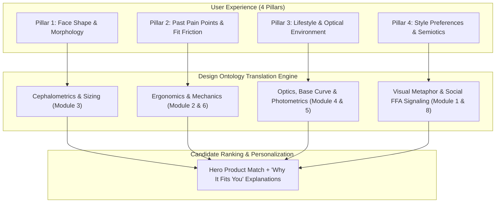

# Quizly Onboarding Architecture: 4-Pillar Question Framework
## Translating Human Inputs into the 16-Dimensional Sunglasses Design Ontology

---

## 1. System Overview & Data Flow



---

## 2. The 4 Question Pillars & Ontological Mappings

### Pillar 1: Face Shape & Facial Morphology
*Ontological Link: [Module 3: Cephalometrics & Facial Morphology](file:///Users/mykytaslobodian/projects/quizly/sunglasses_design_ontology.md#module-3-cephalometrics-facial-morphology--ergonomics)*

| Question ID | Question Text & Context | User Options | Ontological Parameter Mapping |
| :--- | :--- | :--- | :--- |
| **Q1.1: Facial Silhouette** | *"What is your overall face shape and jawline definition?"* | • **Square / Angular** (Broad jawline, defined chin, angular lines)<br>• **Round / Curved** (Soft jawline, full cheeks, balanced length/width)<br>• **Oval / Balanced** (Symmetrical proportions, gentle taper to chin)<br>• **Heart / Inverted Triangle** (Broad brow/cheekbones, narrow chin)<br>• **Oblong / Tall** (Long vertical face, straight cheeklines) | • **Square**: Soft curvilinear rims (Round, Oval, Teardrop Panto) to soften angular mass via Gestalt counter-balancing.<br>• **Round**: High aspect ratio ($> 1.8:1$), crisp horizontal rectangular lines.<br>• **Oval**: Full silhouette latitude; exact temple-to-temple sizing.<br>• **Heart**: Thin wire rims, bottom-heavy lens curves, rimless mounts.<br>• **Oblong**: Lens depth $>45\text{mm}$, thick horizontal brow bar. |
| **Q1.2: Width & Sizing** | *"How do standard one-size sunglasses typically fit your head width?"* | • **Too tight / pinches temples**<br>• **Standard / flush fit**<br>• **Too wide / slides or looks oversized** | • **Tight**: Frame width $\ge 144\text{mm}$, Eye size $\ge 56\text{mm}$.<br>• **Standard**: Frame width $136\text{–}142\text{mm}$, Eye size $50\text{–}54\text{mm}$.<br>• **Wide**: Frame width $\le 134\text{mm}$, Eye size $46\text{–}49\text{mm}$.<br>*(Ensures optical centration in upper 40% of lens)*. |

---

### Pillar 2: Past Pain Points (Ergonomics & Physical Fit)
*Ontological Link: [Module 2: Perceptual Anatomy & Bridge Metrics](file:///Users/mykytaslobodian/projects/quizly/sunglasses_design_ontology.md#module-2-morphological--perceptual-anatomy-of-eyewear) & [Module 6: Material Science](file:///Users/mykytaslobodian/projects/quizly/sunglasses_design_ontology.md#module-6-material-science-tactility--structural-semiotics)*

| Question ID | Question Text & Context | User Options | Ontological Parameter Mapping |
| :--- | :--- | :--- | :--- |
| **Q2.1: Nose Bridge Stability** | *"What has frustrated you most with sunglasses staying in place?"* | • **Constantly slides down my nose**<br>• **Leaves deep red pinch marks on nasal crest**<br>• **Sits too high above my eyebrows**<br>• **No issues / standard fit** | • **Sliding**: Built-up saddle bridge or Japanese titanium/ceramic adjustable pads with silicone coating.<br>• **Pinching**: Keyhole bridge (lateral weight distribution) or ultra-lightweight chassis ($<12\text{g}$).<br>• **High Brow Intersection**: Low-profile keyhole bridge with high brow clearance. |
| **Q2.2: Cheekbone Contact** | *"Do your sunglasses touch your cheeks when smiling or talking?"* | • **Yes, often (lifts off nose or fogs up)**<br>• **No, never (clear air gap)** | • **Yes**: Vertex distance $>13\text{mm}$, Pantoscopic tilt relaxed to $6^\circ\text{–}8^\circ$, high zygomatic bevel chamfers.<br>• **No**: Standard pantoscopic tilt ($10^\circ\text{–}12^\circ$). |
| **Q2.3: Long-Wear Fatigue** | *"After wearing sunglasses for 2+ hours, what do you usually feel?"* | • **Headaches or temple bite behind ears**<br>• **Bridge feels heavy and tired**<br>• **Slip forward when looking down**<br>• **Zero discomfort** | • **Temple Bite**: Flexible $\beta$-Titanium alloy or core-wire chamfered paddles.<br>• **Heavy Bridge**: Ultra-low-density Grilamid TR-90 ($1.04\text{ g/cm}^3$) or rimless titanium mounts.<br>• **Forward Slipping**: Curved cable temples or co-molded rubberized ear grips. |

---

### Pillar 3: Lifestyle & Optical Environments
*Ontological Link: [Module 4: Situational Archetypes](file:///Users/mykytaslobodian/projects/quizly/sunglasses_design_ontology.md#module-4-contextual--situational-archetypes) & [Module 5: Lens Chromatics](file:///Users/mykytaslobodian/projects/quizly/sunglasses_design_ontology.md#module-5-lens-chromatics-psychophysics--optical-engineering)*

| Question ID | Question Text & Context | User Options | Ontological Parameter Mapping |
| :--- | :--- | :--- | :--- |
| **Q3.1: Primary Usage Setting** | *"Where will you wear these sunglasses the most?"* | • **City & Everyday Routine** (Street, commute, outdoor café)<br>• **Water, Beach & Alpine Glare** (Boating, ocean, skiing)<br>• **Dynamic Sports & Workouts** (Cycling, running, training)<br>• **Driving & Road Trips** (Highway, touring, asphalt glare)<br>• **Golden Hour & Social Events** (Sunsets, evening terraces, clubs) | • **City**: Base Curve 2–4, G-15 Green or Neutral Grey lenses, standard acetate/titanium.<br>• **Water/Snow**: Base Curve 6–8, Category 3–4 polarized Barberini glass, silver dielectric flash mirrors.<br>• **Sport**: Base Curve 8–9 wrap, ventilated TR-90 chassis, toric high-impact polycarbonate.<br>• **Driving**: HEV blue-blocker Amber/Copper polarized lenses, thin lateral temples.<br>• **Golden Hour**: Base Curve 0–2 flat lenses, Category 1–2 translucent gradient (Rose, Plum, Amber). |

---

### Pillar 4: Style Preferences & Visual Semiotics
*Ontological Link: [Module 1: Metaphor Engine](file:///Users/mykytaslobodian/projects/quizly/sunglasses_design_ontology.md#module-1-the-visual-semantic-metaphor-engine), [Module 7: Historical Lineages](file:///Users/mykytaslobodian/projects/quizly/sunglasses_design_ontology.md#module-7-historical-evolution--archetypal-lineages) & [Module 8: Cognitive Neuroscience](file:///Users/mykytaslobodian/projects/quizly/sunglasses_design_ontology.md#module-8-cognitive-neuroscience-facial-perception--social-semiotics)*

| Question ID | Question Text & Context | User Options | Ontological Parameter Mapping |
| :--- | :--- | :--- | :--- |
| **Q4.1: Social Signaling & Tint** | *"How dark and private do you prefer your lenses to be?"* | • **Fully Impenetrable & Dark** (Zero eye visibility, stoic, commanding)<br>• **Classic Balanced Dark** (Traditional sun protection, rich depth)<br>• **Luminous Gradient** (Eyes visible, conversational warmth)<br>• **Expressive Tint** (Vintage amber, rose, or ocean blue) | • **Impenetrable**: Category 3/4 Obsidian or mirror ($\text{VLT } < 10\%$). Enforces unilateral gaze, blocks STS social mentalizing.<br>• **Classic**: Category 3 G-15/Neutral Grey ($\text{VLT } 12\text{–}15\%$).<br>• **Luminous / Gradient**: $\text{VLT } 25\text{–}40\%$, preserves Fusiform Face Area (FFA) emotional microexpression exchange.<br>• **Expressive**: High VLT ($40\text{–}70\%$), high chromatic resonance. |
| **Q4.2: Design Lineage & Aesthetic Vibe** | *"Which aesthetic world best describes your personal style?"* | • **Heritage & Timeless Vintage** (1950s Americana, Havana tortoise, Riviera cool)<br>• **Architectural & Bold Brutalism** (Heavy slab acetate, sharp geometric bevels)<br>• **Minimalist & Pure Intellectual** (Featherweight Japanese titanium wire, clean Bauhaus circles)<br>• **Sensual & Sculptural** (Upswept cat-eyes, translucent jewel crystals, flowing curves)<br>• **Cybernetic & High-Tech Futuristic** (Mono-shields, floating lenses, dark matte carbon) | • **Heritage**: Panto / Wayfarer / Clubmaster, Mazzucchelli acetate + filigree core wire.<br>• **Architectural**: 9–12mm thick slab acetate, flat-top browline, Base 0 flat lenses.<br>• **Minimalist**: 0.8mm $\beta$-Titanium rimless/wire, Base 2 spherical, screwless hinges.<br>• **Sensual**: Feline Cat-Eye ($15\text{–}30^\circ$ temporal sweep), honey crystal acetate.<br>• **Cybernetic**: Mono-shield visor, dichroic multi-layer coating, SLS 3D titanium brow. |

---

## 3. Dynamic Rationale Generation Engine ("Why It Fits You")

When the onboarding completes, Quizly dynamically constructs a 4-part personalized justification using the answers:

```json
{
  "recommendation": {
    "product_name": "The Aurelius Titanium Panto",
    "match_score": "96%",
    "personalized_why": [
      {
        "pillar": "Face Shape & Morphology",
        "rationale": "Curvilinear Panto rims soften your defined, angular jawline through visual counter-balancing."
      },
      {
        "pillar": "Past Pain Points Resolved",
        "rationale": "Medical-grade Japanese titanium construction (<9 grams) and ceramic nose pads eliminate bridge slipping and red pressure marks."
      },
      {
        "pillar": "Lifestyle & Lighting Precision",
        "rationale": "Polarized Category 3 Barberini mineral glass with high-contrast amber tint cuts reflective highway and water glare while keeping your vision crisp."
      },
      {
        "pillar": "Style & Social Semiotics",
        "rationale": "Soft 2-tone gradient lenses preserve natural eye contact and approachable presence without compromising UV400 sun protection."
      }
    ]
  }
}
```
