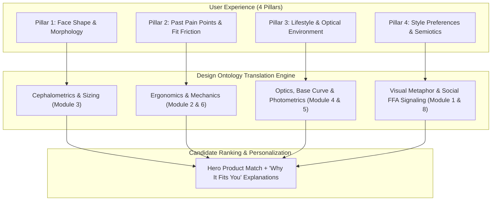

# Quizly Onboarding Architecture: 4-Pillar Question Framework
## Translating Human Inputs into the 16-Dimensional Sunglasses Design Ontology

---

## 1. System Overview & Data Flow



---

## 2. The Question Pillars & Ontological Mappings

### Pillar 1: Face Shape & Facial Morphology
*Ontological Link: [Module 3: Cephalometrics & Facial Morphology](file:///Users/mykytaslobodian/projects/quizly/sunglasses_design_ontology.md#module-3-cephalometrics-facial-morphology--ergonomics)*

| Question ID | Question Text & Context | User Options | Ontological Parameter Mapping |
| :--- | :--- | :--- | :--- |
| **Q1.1a: Face Ratio** | *"Is your face longer than it is wide, or about equal?"* | • **Noticeably longer than wide** (`vertical_dominant`)<br>• **About equal** (`balanced_ratio`) | • **Vertical Dominant**: Frame depth $\ge 45\text{mm}$, strong horizontal browline to bisect vertical midface.<br>• **Balanced**: Balanced aspect ratio ($1.2:1\text{ to }1.5:1$), standard eye size ($50\text{–}54\text{mm}$). |
| **Q1.1b: Jawline Definition** | *"Your jawline: more defined and angular, or softer and rounded?"* | • **Defined and angular** (`jaw_angular`)<br>• **Soft and rounded** (`jaw_soft`) | • **Angular**: Curvilinear rims (Round, Oval, Panto) for Gestalt counter-balancing.<br>• **Soft**: Angular, rectangular, or geometric frame vertices to provide structural contouring. |
| **Q1.1c: Face Width Taper** | *"Which is wider, your forehead and cheekbones, or your jaw?"* | • **Forehead and cheekbones, chin tapers** (`taper_to_chin`)<br>• **About the same all the way down** (`uniform_width`)<br>• **My jaw is the widest part** (`jaw_dominant`) | • **Taper to chin (Heart/Triangle)**: Bottom-heavy lens curves, slim wire rims, rimless mounts.<br>• **Uniform (Square/Oval)**: Symmetric frame silhouette matching cranial baseline.<br>• **Jaw Dominant**: Prominent browline / Clubmaster to balance lower-third mass. |
| **Q1.2: Width & Sizing** | *"How do standard one-size sunglasses typically fit your head width?"* | • **Too tight, pinch temples** (`width_tight`)<br>• **About right** (`width_standard`)<br>• **Too wide, slide or look oversized** (`width_wide`) | • **Tight**: Frame width $\ge 144\text{mm}$, Eye size $\ge 56\text{mm}$, spring hinges.<br>• **Standard**: Frame width $136\text{–}142\text{mm}$, Eye size $50\text{–}54\text{mm}$.<br>• **Wide**: Frame width $\le 134\text{mm}$, Eye size $46\text{–}49\text{mm}$. |
| **Q1.3: Browline Alignment** | *"How do sunglasses usually align with your eyebrows?"* | • **Sit right along my browline** (`brow_aligned`)<br>• **Completely cover my eyebrows** (`brow_covered`)<br>• **Eyebrows stick out far above** (`brow_exposed`) | • **Aligned**: Standard brow bar curve matching supraorbital arch.<br>• **Covered**: Low-profile top bar or shallow lens depth ($<40\text{mm}$).<br>• **Exposed**: High brow bar or oversized frame depth ($\ge 48\text{mm}$). |
| **Q1.4: Nose Bridge Profile** | *"How would you describe your nose bridge profile?"* | • **Low / flatter bridge (frames sit on cheeks)** (`bridge_low_asian_fit`)<br>• **High and narrow bridge (frames pinch/sit high)** (`bridge_high_narrow`)<br>• **Standard / average bridge** (`bridge_standard`) | • **Low Bridge**: Asian-Fit geometry, extended built-up saddle or adjustable titanium pads.<br>• **High/Narrow**: Keyhole bridge architecture for lateral weight distribution.<br>• **Standard**: Universal saddle bridge. |
| **Q1.5: Contrast & Undertone** | *"How would you describe the contrast between your hair, eyes, and skin?"* | • **High contrast (dark hair + fair skin, or striking bright eyes)** (`contrast_high`)<br>• **Warm & golden (olive, honey, bronze undertones)** (`contrast_warm`)<br>• **Soft & low contrast (tones blend smoothly)** (`contrast_muted`)<br>• **Deep & rich (deep skin and hair, uniform intensity)** (`contrast_deep`) | • **High Contrast**: High chromatic contrast frames (Jet Black, Polished Chrome, Stark Monochromes).<br>• **Warm**: Mazzucchelli Havana Tortoise, 18K Gold, Honey Crystal.<br>• **Soft/Muted**: Translucent champagne, brushed matte titanium, smoke gradient.<br>• **Deep**: Rich espresso, dark ruthenium, deep obsidian. |

---

### Pillar 2: Past Pain Points (Ergonomics & Physical Fit)
*Ontological Link: [Module 2: Perceptual Anatomy & Bridge Metrics](file:///Users/mykytaslobodian/projects/quizly/sunglasses_design_ontology.md#module-2-morphological--perceptual-anatomy-of-eyewear) & [Module 6: Material Science](file:///Users/mykytaslobodian/projects/quizly/sunglasses_design_ontology.md#module-6-material-science-tactility--structural-semiotics)*

| Question ID | Question Text & Context | User Options | Ontological Parameter Mapping |
| :--- | :--- | :--- | :--- |
| **Q2.0: Past Regret Trigger** | *"What usually makes you stop wearing a pair you thought you liked?"* | • **Looked good in mirror, felt 'too much' in real life** (`regret_overpowering`)<br>• **Discomfort: started aching or slipping after 30 min** (`regret_discomfort`)<br>• **Felt generic and didn't feel like 'me'** (`regret_impersonal`)<br>• **Scratched or felt flimsy quickly** (`regret_fragility`) | • **Overpowering**: Caps frame gauge $\le 6\text{mm}$; eliminates extreme geometric wraps.<br>• **Discomfort**: Prioritizes Japanese Beta-Titanium ($<12\text{g}$) and ceramic/silicone pads.<br>• **Generic**: Routes to artisanal heritage or architectural silhouettes with custom filigree.<br>• **Fragility**: High-density cured acetate or forged carbon with 5–7 barrel hinges. |
| **Q2.1: Nose Bridge Stability** | *"What frustrates you most about sunglasses staying in place?"* | • **Slide down nose constantly** (`bridge_slipping`)<br>• **Leave red pinch marks on nose** (`bridge_pressure`)<br>• **Sit too high, above eyebrows** (`bridge_too_high`)<br>• **No issues, fit fine** (`bridge_fine`) | • **Sliding**: Built-up saddle bridge or Japanese silicone/ceramic adjustable pads.<br>• **Pressure**: Keyhole bridge lateral dispersal or ultra-lightweight chassis ($<12\text{g}$).<br>• **Too High**: Low-profile bridge mount with deep lens positioning. |
| **Q2.2: Cheekbone Contact** | *"Do the frames touch your cheeks when you smile or talk?"* | • **Yes, lift off nose or fog up** (`cheek_contact_yes`)<br>• **No, there's a clear gap** (`cheek_contact_no`) | • **Yes**: Vertex distance $>13\text{mm}$, pantoscopic tilt relaxed to $6^\circ\text{–}8^\circ$, zygomatic bevel chamfers.<br>• **No**: Standard pantoscopic tilt ($10^\circ\text{–}12^\circ$). |
| **Q2.3: Long-Wear Fatigue** | *"After two hours of wear, what do you usually feel?"* | • **Headache / soreness behind ears** (`fatigue_temple_bite`)<br>• **Heavy and tired across bridge** (`fatigue_bridge_load`)<br>• **Creep forward when looking down** (`fatigue_forward_slip`)<br>• **Nothing, no discomfort** (`fatigue_none`) | • **Temple Bite**: Flexible $\beta$-Titanium alloy or chamfered paddle temples.<br>• **Heavy Bridge**: Ultra-low-density Grilamid TR-90 ($1.04\text{ g/cm}^3$) or rimless mounts.<br>• **Forward Slip**: Cable temple wrap or co-molded hydrophilic rubber ear grips. |
| **Q2.4: Eyelash Smear** | *"Do your eyelashes leave smudges on the lenses?"* | • **Yes, constantly** (`lash_smear_yes`)<br>• **Only with some pairs** (`lash_smear_sometimes`)<br>• **Never noticed** (`lash_smear_no`) | • **Yes**: Increases vertex distance to $\ge 14\text{mm}$; flattens base curve from Base 8/6 to Base 4/2.<br>• **No**: Standard vertex distance ($11\text{–}13\text{mm}$). |
| **Q2.5: Frame Weight Tolerance** | *"How sensitive are you to frame weight on your face?"* | • **Must be featherlight** (`weight_featherlight`)<br>• **Prefer solid, substantial weight** (`weight_substantial`)<br>• **No strong preference** (`weight_neutral`) | • **Featherlight**: $\beta$-Titanium wire or TR-90 chassis ($<15\text{g}$).<br>• **Substantial**: 8–12mm slab Mazzucchelli acetate with custom core wire ($>35\text{g}$). |
| **Q2.6: Headwear Interaction** | *"Do you regularly wear caps, helmets, or over-ear headphones with sunglasses?"* | • **Caps/hats push frames down** (`headwear_cap_hat`)<br>• **Helmets/headphones squeeze temples** (`headwear_helmet_headphones`)<br>• **No, rarely or never** (`headwear_none`) | • **Caps**: Low-profile top bar with flush browline clearance.<br>• **Helmets/Headphones**: Straight ultra-thin bayonet or wire temples without bulky ear bends. |

---

### Pillar 3: Lifestyle & Optical Environments
*Ontological Link: [Module 4: Situational Archetypes](file:///Users/mykytaslobodian/projects/quizly/sunglasses_design_ontology.md#module-4-contextual--situational-archetypes) & [Module 5: Lens Chromatics](file:///Users/mykytaslobodian/projects/quizly/sunglasses_design_ontology.md#module-5-lens-chromatics-psychophysics--optical-engineering)*

| Question ID | Question Text & Context | User Options | Ontological Parameter Mapping |
| :--- | :--- | :--- | :--- |
| **Q3.1: Primary Usage Setting** | *"Where will you wear these most? Pick all that apply."* | • **City & everyday, commuting** (`env_city`)<br>• **Water, beach, boating, snow** (`env_high_glare`)<br>• **Driving & road trips** (`env_driving`)<br>• **Running, cycling, training** (`env_sport`) | • **City**: Base 2–4, G-15 Green or Neutral Grey lenses.<br>• **Water/Snow**: Base 6–8, Category 3–4 polarized Barberini glass, flash mirrors.<br>• **Driving**: Polarized Amber/Copper HEV blue-blockers, thin lateral temples.<br>• **Sport**: Base 8–9 aerodynamic wrap, ventilated TR-90 chassis, toric high-impact polycarbonate. |
| **Q3.2: Glare & Light Sensitivity** | *"How often does bright light make you squint or give you a headache?"* | • **Constantly, even on ordinary days** (`glare_severe`)<br>• **On bright days** (`glare_moderate`)<br>• **Rarely** (`glare_low`)<br>• **Never thought about it** (`glare_unaware`) | • **Severe**: Polarized Category 3/4 lenses ($\text{VLT } < 10\%$) with AR back-coat.<br>• **Moderate**: Standard Category 3 lenses ($\text{VLT } 12\text{–}15\%$).<br>• **Low**: Category 2 or tinted lenses ($\text{VLT } 18\text{–}30\%$). |
| **Q3.3: Vision Correction Status** | *"Do you wear glasses or contacts?"* | • **Glasses** (`rx_glasses`)<br>• **Contacts** (`rx_contacts`)<br>• **Neither** (`rx_none`)<br>• **Both, depends on the day** (`rx_both`) | Establishes baseline optical correction profile for ophthalmic compatibility. |
| **Q3.4: Low-Light & Transition Wear** | *"Do you wear your sunglasses into indoor settings, shade, or as the sun goes down?"* | • **Yes, keep them on indoors/shade** (`lighting_transition_wear`)<br>• **Strictly bright outdoor daylight** (`lighting_bright_only`)<br>• **Love wearing during golden hour/sunset** (`lighting_golden_hour`) | • **Transition Wear**: Category 1–2 gradient tint or photochromic lenses ($\text{VLT } 30\text{–}65\%$).<br>• **Daylight**: Category 3 solid tint ($\text{VLT } 10\text{–}15\%$).<br>• **Golden Hour**: Rose, amber, or warm honey high-contrast tints. |
| **Q3.5: Prescription (Rx) Need** | *"Are you looking for prescription-ready (Rx) sunglasses or standard sun protection?"* | • **Must accommodate prescription (Rx)** (`rx_needed`)<br>• **Standard non-prescription** (`rx_plano`)<br>• **Open to clip-ons or adapters** (`rx_clipon`) | • **Rx Needed**: Base Curve limited to Base 2–6 (eliminates extreme Base 8/9 wraps); ophthalmic bevel grooves.<br>• **Plano**: Unrestricted lens curves and shield geometries. |

---

### Pillar 4: Style Preferences & Visual Semiotics
*Ontological Link: [Module 1: Metaphor Engine](file:///Users/mykytaslobodian/projects/quizly/sunglasses_design_ontology.md#module-1-the-visual-semantic-metaphor-engine), [Module 7: Historical Lineages](file:///Users/mykytaslobodian/projects/quizly/sunglasses_design_ontology.md#module-7-historical-evolution--archetypal-lineages) & [Module 8: Cognitive Neuroscience](file:///Users/mykytaslobodian/projects/quizly/sunglasses_design_ontology.md#module-8-cognitive-neuroscience-facial-perception--social-semiotics)*

| Question ID | Question Text & Context | User Options | Ontological Parameter Mapping |
| :--- | :--- | :--- | :--- |
| **Q4.0: Projected Energy** | *"When you put on sunglasses, what energy do you want to project before saying a word?"* | • **Approachable, warm, easy to talk to** (`persona_approachable`)<br>• **Effortlessly composed & understated** (`persona_understated`)<br>• **Commanding, mysterious, untouchable** (`persona_commanding`)<br>• **Creative, artistic, unapologetically bold** (`persona_expressive`) | • **Approachable**: Luminous gradient / Cat 1–2 tint ($\text{VLT } 25\text{–}40\%$), curvilinear rims to preserve FFA eye gaze.<br>• **Understated**: Minimalist wire / balanced panto, matte finish.<br>• **Commanding**: Cat 3/4 Obsidian, rigid flat-top browline (amplifies supraorbital threat cues, blocks STS).<br>• **Creative**: Unconventional geometry (geometric hex, high-rake cat-eye, dichroic visor). |
| **Q4.1: Social Signaling & Tint** | *"How dark and private do you want the lenses?"* | • **Fully dark, nobody sees eyes** (`tint_opaque`)<br>• **Classic dark, standard protection** (`tint_classic`)<br>• **Lighter gradient, eyes still read** (`tint_gradient`)<br>• **Expressive tint: amber, rose, blue** (`tint_expressive`) | • **Opaque**: Cat 3/4 Obsidian ($\text{VLT } < 10\%$). Enforces stoic unilateral gaze, disables STS eye-tracking.<br>• **Classic**: Cat 3 G-15/Grey ($\text{VLT } 12\text{–}15\%$).<br>• **Gradient**: $\text{VLT } 25\text{–}40\%$, preserves Fusiform Face Area (FFA) emotional microexpression exchange.<br>• **Expressive**: High VLT ($40\text{–}70\%$), high chromatic resonance. |
| **Q4.1b: Visual Volume** | *"Do you want your sunglasses to blend with your features, or be the centerpiece?"* | • **Harmonious extension (subtle, complements natural contours)** (`presence_subtle`)<br>• **The focal point (distinct statement defining my look)** (`presence_statement`) | • **Subtle**: Ultralight wire ($1.0\text{–}2.5\text{mm}$ gauge), rimless or neutral tones.<br>• **Statement**: Bold slab acetate ($8.0\text{–}12.0\text{mm}$ gauge), sharp 3D skiving/bevels, high figure-ground contrast. |
| **Q4.2: Design Lineage & Aesthetic Vibe** | *"Which design aesthetic feels most like your personal style?"* | • **Heritage & Timeless Vintage (Havana tortoise, retro panto)** (`axis_heritage`)<br>• **Architectural & Bold Brutalism (Heavy slab acetate, flat-top)** (`axis_architectural`)<br>• **Minimalist & Intellectual (Featherweight titanium wire round)** (`axis_minimalist`)<br>• **Sensual & Sculptural (Upswept cat-eye, crystal tones)** (`axis_sensual`)<br>• **Cybernetic & High-Tech (Matte carbon, mono-shield wrap)** (`axis_cybernetic`)<br>• **Classic Aviation (Gold teardrop aviator)** (`axis_aviator`)<br>• **Effortless Mid-Century (Crisp black acetate wayfarer)** (`axis_wayfarer`) | Maps directly to archetypal design lineages (Module 7) and physical silhouette families. |
| **Q4.3: Lens Finish & Mirror Coating** | *"Do you prefer a reflective mirror finish, or classic plain tint?"* | • **Reflective flash mirror (high privacy & glare block)** (`lens_mirror`)<br>• **Classic plain tint (natural look, non-reflective)** (`lens_plain`)<br>• **Subtle semi-reflective sheen** (`lens_semi_mirror`) | • **Mirror**: Quarter-wave dielectric coating; maximum psychological shielding.<br>• **Plain**: Pure photopic absorption; authentic organic look.<br>• **Semi-Mirror**: Balanced subtle sheen. |
| **Q4.4: Long-Term Priorities** | *"What matters most in a pair you'd keep for years? Pick all that apply."* | • **Lens quality & protection** (`priority_optics`)<br>• **A fit that stays put** (`priority_fit`)<br>• **The look** (`priority_style`)<br>• **Price** (`priority_price`) | Calibrates algorithmic match weighting across durability, optics, and aesthetic scoring. |
| **Q4.5: Color & Finish Palette** | *"Which frame color and metal finish best fits your signature style?"* | • **Classic Black or Dark Matte** (`palette_black_monochrome`)<br>• **Warm Tortoise or Gold Metals** (`palette_tortoise_gold`)<br>• **Cool Silver, Titanium, Gunmetal** (`palette_silver_titanium`)<br>• **Translucent Crystal or Expressive Tones** (`palette_crystal_expressive`) | Dictates material finishes: Takiron black acetate vs 18K gold electroplate vs brushed titanium vs jewel crystal. |
| **Q4.6: Branding & Logo Semiotics** | *"How do you feel about visible logos and branding on your frames?"* | • **Zero logos — quiet luxury** (`branding_minimal_quiet`)<br>• **Subtle micro-engravings / hardware** (`branding_subtle_details`)<br>• **Bold logo or signature icon** (`branding_statement`) | Filters quiet luxury / artisanal unbranded models vs visible prestige hardware markers. |

---

### Pillar 5: Commercial & Conversion Calibration
*Ontological Link: Purchase intent, catalog gating, and conversion triggers*

| Question ID | Question Text & Context | User Options | Ontological Parameter Mapping |
| :--- | :--- | :--- | :--- |
| **Q5.0: Desired Feeling** | *"Complete this sentence: A great pair of sunglasses should make me feel..."* | • **Instantly elevated & put-together** (`aspiration_elevated`)<br>• **Shielded with private confidence** (`aspiration_shielded`)<br>• **Ready for outdoor action** (`aspiration_carefree`)<br>• **Like best, most stylish version of myself** (`aspiration_signature`) | Directly feeds conversion hook copy and hero product rationale engine. |
| **Q5.1: Purchase Recency** | *"When did you last buy sunglasses you actually loved?"* | • **This year** (`recency_this_year`)<br>• **1–2 years ago** (`recency_1_2_years`)<br>• **Longer than I remember** (`recency_long_ago`)<br>• **Never, grab whatever's cheap** (`recency_never`) | Establishes user's past eyewear satisfaction and replacement frequency. |
| **Q5.2: Urgency** | *"How soon do you need them?"* | • **This week, event coming up** (`urgency_week`)<br>• **This month** (`urgency_month`)<br>• **Just browsing for now** (`urgency_browsing`) | Calibrates conversion timing and fast-shipping inventory prioritization. |
| **Q5.3: Budget Bracket** | *"What's your budget for a pair you'll wear every day?"* | • **Under $80** (`budget_under_80`)<br>• **$80 to $150** (`budget_80_150`)<br>• **$150 to $250** (`budget_150_250`)<br>• **Whatever it takes, if they fit** (`budget_open`) | Hard price filter on catalog datastore query. |
| **Q5.4: Collection Role** | *"What main role will this pair play in your sunglasses collection?"* | • **My primary everyday driver** (`role_daily_driver`)<br>• **Specialized pair for activity/trip** (`role_activity_travel`)<br>• **Stylish accent piece to rotate in** (`role_style_accent`)<br>• **A gift for someone else** (`role_gift`) | Prioritizes high-versatility hero products vs specialized niche archetypes. |

---

## 3. Dynamic Rationale Generation Engine ("Why It Fits You")

When the onboarding completes, Quizly dynamically constructs a 4-part personalized justification using the answers:

```json
{
  "recommendation": {
    "product_name": "The Aurelius Titanium Panto",
    "match_score": "96%",
    "personalized_why": [
      {
        "pillar": "Face Shape & Morphology",
        "rationale": "Curvilinear Panto rims soften your defined, angular jawline through visual counter-balancing."
      },
      {
        "pillar": "Past Pain Points Resolved",
        "rationale": "Medical-grade Japanese titanium construction (<9 grams) and ceramic nose pads eliminate bridge slipping and red pressure marks."
      },
      {
        "pillar": "Lifestyle & Lighting Precision",
        "rationale": "Polarized Category 3 Barberini mineral glass with high-contrast amber tint cuts reflective highway and water glare while keeping your vision crisp."
      },
      {
        "pillar": "Style & Social Semiotics",
        "rationale": "Soft 2-tone gradient lenses preserve natural eye contact and approachable presence without compromising UV400 sun protection."
      }
    ]
  }
}
```

---

## 4. Backend DTO Schema & Machine-Readable Question Catalog

The questions in this framework map directly to the backend NestJS DTOs defined in [`apps/backend/src/quiz.dto.ts`](file:///Users/illia.kazachkovskyi/Documents/Illia%20Project/quizly/apps/backend/src/quiz.dto.ts):

### Official Question DTO Schema
```typescript
export const QUESTION_TYPES = [
  'binary',       // Exactly 2 answers (e.g. Yes/No, or 2 contrasting options)
  'multiChoice',  // Exactly 4 answers (multiple selection supported)
  'singleChoice', // 2 to 4 answers (single selection)
] as const;
export type QuestionType = (typeof QUESTION_TYPES)[number];

export class QuestionDto {
  question: string;
  answers: string[];
  typeOfQuestion: QuestionType;
}

export class AnsweredQuestionDto extends QuestionDto {
  selectedAnswers: string[];
}

export class NextQuestionResponseDto {
  nextQuestion: QuestionDto | null; // null when 7-15 questions completed
}
```

### Complete 32-Question Diagnostic Catalog (JSON)
Complete onboarding questionnaire ready for the agent prompt, frontend rendering, and backend validation:

```json
[
  {
    "id": "Q1.1a",
    "pillar": "face_morphology",
    "question": "Is your face longer than it is wide, or about equal?",
    "type": "single_choice",
    "choices": [
      { "label": "Noticeably longer than wide", "value": "vertical_dominant" },
      { "label": "About equal", "value": "balanced_ratio" }
    ]
  },
  {
    "id": "Q1.1b",
    "pillar": "face_morphology",
    "question": "Your jawline: more defined and angular, or softer and rounded?",
    "type": "single_choice",
    "choices": [
      { "label": "Defined and angular", "value": "jaw_angular" },
      { "label": "Soft and rounded", "value": "jaw_soft" }
    ]
  },
  {
    "id": "Q1.1c",
    "pillar": "face_morphology",
    "question": "Which is wider, your forehead and cheekbones, or your jaw?",
    "type": "single_choice",
    "choices": [
      { "label": "Forehead and cheekbones, my chin tapers", "value": "taper_to_chin" },
      { "label": "About the same all the way down", "value": "uniform_width" },
      { "label": "My jaw is the widest part", "value": "jaw_dominant" }
    ]
  },
  {
    "id": "Q1.2",
    "pillar": "face_morphology",
    "question": "How do one-size sunglasses usually fit your head width?",
    "type": "single_choice",
    "choices": [
      { "label": "Too tight, they pinch my temples", "value": "width_tight" },
      { "label": "About right", "value": "width_standard" },
      { "label": "Too wide, they slide or look oversized", "value": "width_wide" }
    ]
  },
  {
    "id": "Q1.3",
    "pillar": "face_morphology",
    "question": "How do sunglasses usually align with your eyebrows?",
    "type": "single_choice",
    "choices": [
      { "label": "They sit right along my browline", "value": "brow_aligned" },
      { "label": "They completely cover my eyebrows", "value": "brow_covered" },
      { "label": "My eyebrows stick out far above the frame", "value": "brow_exposed" }
    ]
  },
  {
    "id": "Q1.4",
    "pillar": "face_morphology",
    "question": "How would you describe your nose bridge profile?",
    "type": "single_choice",
    "choices": [
      { "label": "Low or flatter bridge (frames often sit on cheeks)", "value": "bridge_low_asian_fit" },
      { "label": "High and narrow bridge (frames often pinch or sit high)", "value": "bridge_high_narrow" },
      { "label": "Standard or average bridge", "value": "bridge_standard" }
    ]
  },
  {
    "id": "Q1.5",
    "pillar": "face_morphology",
    "question": "How would you describe the contrast between your hair, eyes, and skin?",
    "type": "single_choice",
    "choices": [
      { "label": "High contrast (e.g. dark hair with fair skin, or striking bright eyes)", "value": "contrast_high" },
      { "label": "Warm and golden (olive, honey, amber, or bronze undertones)", "value": "contrast_warm" },
      { "label": "Soft and low contrast (tones blend smoothly, muted or monochrome)", "value": "contrast_muted" },
      { "label": "Deep and rich (deep skin and hair with uniform intensity)", "value": "contrast_deep" }
    ]
  },
  {
    "id": "Q2.0",
    "pillar": "fit_pain_points",
    "question": "What usually makes you stop wearing a pair you thought you liked?",
    "type": "single_choice",
    "choices": [
      { "label": "They looked great in the mirror, but felt like 'too much' in real life", "value": "regret_overpowering" },
      { "label": "Discomfort: they started aching or slipping after 30 minutes", "value": "regret_discomfort" },
      { "label": "They felt generic and didn't feel like 'me' after a few wears", "value": "regret_impersonal" },
      { "label": "They scratched or felt flimsy way too quickly", "value": "regret_fragility" }
    ]
  },
  {
    "id": "Q2.1",
    "pillar": "fit_pain_points",
    "question": "What frustrates you most about sunglasses staying in place?",
    "type": "single_choice",
    "choices": [
      { "label": "They slide down my nose constantly", "value": "bridge_slipping" },
      { "label": "They leave red pinch marks on my nose", "value": "bridge_pressure" },
      { "label": "They sit too high, above my eyebrows", "value": "bridge_too_high" },
      { "label": "No issues, they fit fine", "value": "bridge_fine" }
    ]
  },
  {
    "id": "Q2.2",
    "pillar": "fit_pain_points",
    "question": "Do the frames touch your cheeks when you smile or talk?",
    "type": "single_choice",
    "choices": [
      { "label": "Yes, they lift off my nose or fog up", "value": "cheek_contact_yes" },
      { "label": "No, there's a clear gap", "value": "cheek_contact_no" }
    ]
  },
  {
    "id": "Q2.3",
    "pillar": "fit_pain_points",
    "question": "After two hours of wear, what do you usually feel?",
    "type": "single_choice",
    "choices": [
      { "label": "Headache, or soreness behind my ears", "value": "fatigue_temple_bite" },
      { "label": "Heavy and tired across the bridge", "value": "fatigue_bridge_load" },
      { "label": "They creep forward when I look down", "value": "fatigue_forward_slip" },
      { "label": "Nothing, no discomfort", "value": "fatigue_none" }
    ]
  },
  {
    "id": "Q2.4",
    "pillar": "fit_pain_points",
    "question": "Do your eyelashes leave smudges on the lenses?",
    "type": "single_choice",
    "choices": [
      { "label": "Yes, constantly", "value": "lash_smear_yes" },
      { "label": "Only with some pairs", "value": "lash_smear_sometimes" },
      { "label": "Never noticed", "value": "lash_smear_no" }
    ]
  },
  {
    "id": "Q2.5",
    "pillar": "fit_pain_points",
    "question": "How sensitive are you to frame weight on your face?",
    "type": "single_choice",
    "choices": [
      { "label": "Must be featherlight — I dislike feeling frames", "value": "weight_featherlight" },
      { "label": "I prefer a solid, substantial feel (feels premium)", "value": "weight_substantial" },
      { "label": "No strong preference", "value": "weight_neutral" }
    ]
  },
  {
    "id": "Q2.6",
    "pillar": "fit_pain_points",
    "question": "Do you regularly wear caps, helmets, or over-ear headphones with sunglasses?",
    "type": "single_choice",
    "choices": [
      { "label": "Yes, caps/hats often push top of frames down", "value": "headwear_cap_hat" },
      { "label": "Yes, helmets or headphones squeeze the temple arms", "value": "headwear_helmet_headphones" },
      { "label": "No, rarely or never", "value": "headwear_none" }
    ]
  },
  {
    "id": "Q3.1",
    "pillar": "lifestyle_optics",
    "question": "Where will you wear these most? Pick all that apply.",
    "type": "multi_choice",
    "choices": [
      { "label": "City and everyday, commuting, terraces", "value": "env_city" },
      { "label": "Water, beach, boating, snow", "value": "env_high_glare" },
      { "label": "Driving and road trips", "value": "env_driving" },
      { "label": "Running, cycling, training", "value": "env_sport" }
    ]
  },
  {
    "id": "Q3.2",
    "pillar": "lifestyle_optics",
    "question": "How often does bright light make you squint or give you a headache?",
    "type": "single_choice",
    "choices": [
      { "label": "Constantly, even on ordinary days", "value": "glare_severe" },
      { "label": "On bright days", "value": "glare_moderate" },
      { "label": "Rarely", "value": "glare_low" },
      { "label": "Never thought about it", "value": "glare_unaware" }
    ]
  },
  {
    "id": "Q3.3",
    "pillar": "lifestyle_optics",
    "question": "Do you wear glasses or contacts?",
    "type": "single_choice",
    "choices": [
      { "label": "Glasses", "value": "rx_glasses" },
      { "label": "Contacts", "value": "rx_contacts" },
      { "label": "Neither", "value": "rx_none" },
      { "label": "Both, depends on the day", "value": "rx_both" }
    ]
  },
  {
    "id": "Q3.4",
    "pillar": "lifestyle_optics",
    "question": "Do you wear your sunglasses into indoor settings, shade, or as the sun goes down?",
    "type": "single_choice",
    "choices": [
      { "label": "Yes, I keep them on moving indoors or into shade", "value": "lighting_transition_wear" },
      { "label": "Strictly bright outdoor daylight", "value": "lighting_bright_only" },
      { "label": "I love wearing them during golden hour and sunset", "value": "lighting_golden_hour" }
    ]
  },
  {
    "id": "Q3.5",
    "pillar": "lifestyle_optics",
    "question": "Are you looking for prescription-ready (Rx) sunglasses or standard sun protection?",
    "type": "single_choice",
    "choices": [
      { "label": "Must accommodate prescription lenses (Rx)", "value": "rx_needed" },
      { "label": "Standard non-prescription sun lenses", "value": "rx_plano" },
      { "label": "Open to optical clip-ons or adapters", "value": "rx_clipon" }
    ]
  },
  {
    "id": "Q4.0",
    "pillar": "style_semiotics",
    "question": "When you put on sunglasses, what energy do you want to project before saying a word?",
    "type": "single_choice",
    "choices": [
      { "label": "Approachable, warm, and easy to talk to", "value": "persona_approachable" },
      { "label": "Effortlessly composed and quietly understated", "value": "persona_understated" },
      { "label": "Commanding, mysterious, and untouchable", "value": "persona_commanding" },
      { "label": "Creative, artistic, and unapologetically bold", "value": "persona_expressive" }
    ]
  },
  {
    "id": "Q4.1",
    "pillar": "style_semiotics",
    "question": "How dark and private do you want the lenses?",
    "type": "single_choice",
    "choices": [
      { "label": "Fully dark, nobody sees my eyes", "value": "tint_opaque" },
      { "label": "Classic dark, standard sun protection", "value": "tint_classic" },
      { "label": "Lighter gradient, my eyes still read", "value": "tint_gradient" },
      { "label": "Tinted and expressive: amber, rose, blue", "value": "tint_expressive" }
    ]
  },
  {
    "id": "Q4.1b",
    "pillar": "style_semiotics",
    "question": "Do you want your sunglasses to blend with your features, or be the centerpiece?",
    "type": "single_choice",
    "choices": [
      { "label": "Harmonious extension: subtle, compliments my natural facial contours", "value": "presence_subtle" },
      { "label": "The focal point: a distinct statement that defines my look", "value": "presence_statement" }
    ]
  },
  {
    "id": "Q4.2",
    "pillar": "style_semiotics",
    "question": "Which design aesthetic feels most like your personal style?",
    "type": "single_choice",
    "choices": [
      { "label": "Heritage & Timeless Vintage (Havana tortoise, retro panto, Riviera cool)", "value": "axis_heritage" },
      { "label": "Architectural & Bold Brutalism (Heavy slab acetate, sharp geometric flat-top)", "value": "axis_architectural" },
      { "label": "Minimalist & Intellectual (Featherweight titanium wire, clean Bauhaus circles)", "value": "axis_minimalist" },
      { "label": "Sensual & Sculptural (Upswept cat-eye, translucent honey crystals)", "value": "axis_sensual" },
      { "label": "Cybernetic & High-Tech (Matte carbon, high-wrap mono-shield)", "value": "axis_cybernetic" },
      { "label": "Classic Aviation (Gold teardrop aviator with double brow bar)", "value": "axis_aviator" },
      { "label": "Effortless Mid-Century Cool (Crisp black acetate wayfarer)", "value": "axis_wayfarer" }
    ]
  },
  {
    "id": "Q4.3",
    "pillar": "style_semiotics",
    "question": "Do you prefer a reflective mirror finish, or classic plain tint?",
    "type": "single_choice",
    "choices": [
      { "label": "Reflective flash mirror (high privacy & maximum glare block)", "value": "lens_mirror" },
      { "label": "Classic plain tint (natural, clean look without reflection)", "value": "lens_plain" },
      { "label": "Subtle semi-reflective sheen", "value": "lens_semi_mirror" }
    ]
  },
  {
    "id": "Q4.4",
    "pillar": "style_semiotics",
    "question": "What matters most in a pair you'd keep for years? Pick all that apply.",
    "type": "multi_choice",
    "choices": [
      { "label": "Lens quality and protection", "value": "priority_optics" },
      { "label": "A fit that stays put", "value": "priority_fit" },
      { "label": "The look", "value": "priority_style" },
      { "label": "Price", "value": "priority_price" }
    ]
  },
  {
    "id": "Q4.5",
    "pillar": "style_semiotics",
    "question": "Which frame color and metal finish best fits your signature style?",
    "type": "single_choice",
    "choices": [
      { "label": "Classic Black or Dark Matte (sleek & versatile)", "value": "palette_black_monochrome" },
      { "label": "Warm Tortoise or Gold Metals (rich & timeless)", "value": "palette_tortoise_gold" },
      { "label": "Cool Silver, Titanium, or Gunmetal (modern & crisp)", "value": "palette_silver_titanium" },
      { "label": "Translucent Crystal or Expressive Tones (rose, amber, honey)", "value": "palette_crystal_expressive" }
    ]
  },
  {
    "id": "Q4.6",
    "pillar": "style_semiotics",
    "question": "How do you feel about visible logos and branding on your frames?",
    "type": "single_choice",
    "choices": [
      { "label": "Zero logos — unbranded quiet luxury", "value": "branding_minimal_quiet" },
      { "label": "Subtle micro-engravings or hardware accents", "value": "branding_subtle_details" },
      { "label": "Bold logo or signature icon", "value": "branding_statement" }
    ]
  },
  {
    "id": "Q5.0",
    "pillar": "commercial",
    "question": "Complete this sentence: A great pair of sunglasses should make me feel...",
    "type": "single_choice",
    "choices": [
      { "label": "Instantly elevated and put-together, even in a t-shirt", "value": "aspiration_elevated" },
      { "label": "Shielded from the world with private confidence", "value": "aspiration_shielded" },
      { "label": "Ready for outdoor action without babysitting delicate frames", "value": "aspiration_carefree" },
      { "label": "Like the best, most stylish version of myself", "value": "aspiration_signature" }
    ]
  },
  {
    "id": "Q5.1",
    "pillar": "commercial",
    "question": "When did you last buy sunglasses you actually loved?",
    "type": "single_choice",
    "choices": [
      { "label": "This year", "value": "recency_this_year" },
      { "label": "One to two years ago", "value": "recency_1_2_years" },
      { "label": "Longer than I can remember", "value": "recency_long_ago" },
      { "label": "Never, I grab whatever's cheap", "value": "recency_never" }
    ]
  },
  {
    "id": "Q5.2",
    "pillar": "commercial",
    "question": "How soon do you need them?",
    "type": "single_choice",
    "choices": [
      { "label": "This week, I have something coming up", "value": "urgency_week" },
      { "label": "This month", "value": "urgency_month" },
      { "label": "Just browsing for now", "value": "urgency_browsing" }
    ]
  },
  {
    "id": "Q5.3",
    "pillar": "commercial",
    "question": "What's your budget for a pair you'll wear every day?",
    "type": "single_choice",
    "choices": [
      { "label": "Under $80", "value": "budget_under_80" },
      { "label": "$80 to $150", "value": "budget_80_150" },
      { "label": "$150 to $250", "value": "budget_150_250" },
      { "label": "Whatever it takes, if they actually fit", "value": "budget_open" }
    ]
  },
  {
    "id": "Q5.4",
    "pillar": "commercial",
    "question": "What main role will this pair play in your sunglasses collection?",
    "type": "single_choice",
    "choices": [
      { "label": "My primary everyday driver", "value": "role_daily_driver" },
      { "label": "A specialized pair for a specific activity or trip", "value": "role_activity_travel" },
      { "label": "A stylish accent piece to rotate in", "value": "role_style_accent" },
      { "label": "A gift for someone else", "value": "role_gift" }
    ]
  }
]
```

